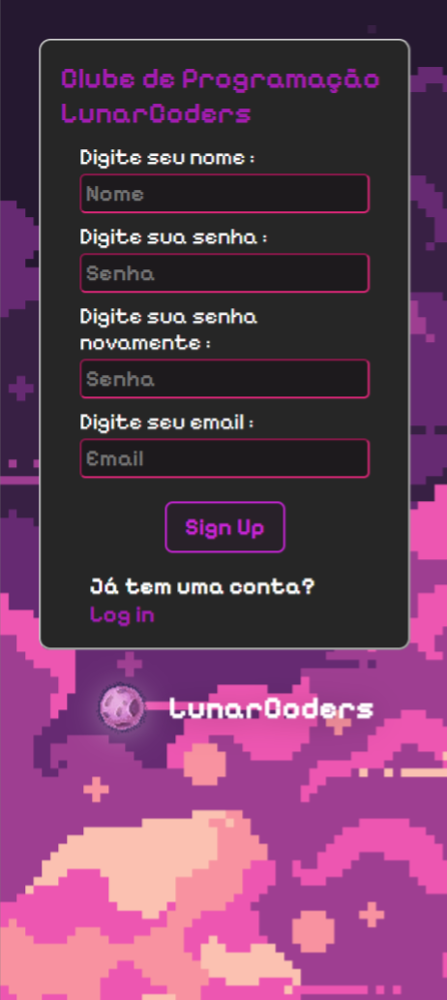

# LunarCoders

## Sobre

LunarCoders é um projeto de teste criado para praticar habilidades de HTML e CSS. Este site de login é estilizado com um tema pixelado e um fundo espacial, trazendo um visual retrô e moderno ao mesmo tempo.

## Captura de Tela

## Tecnologias Utilizadas

- HTML
- CSS
- Google Fonts

## Estrutura do Projeto

- `index.html`: Estrutura HTML do site.
- `styles.css`: Estilo CSS do site.
- `images/`: Pasta contendo as imagens utilizadas no site (incluindo o fundo e o logo).
- `preview/`: Pasta contendo as imagens de preview do site

---

> Projeto desenvolvido apenas para fins de prática e aprendizado. Não possui funcionalidades completas de login.

